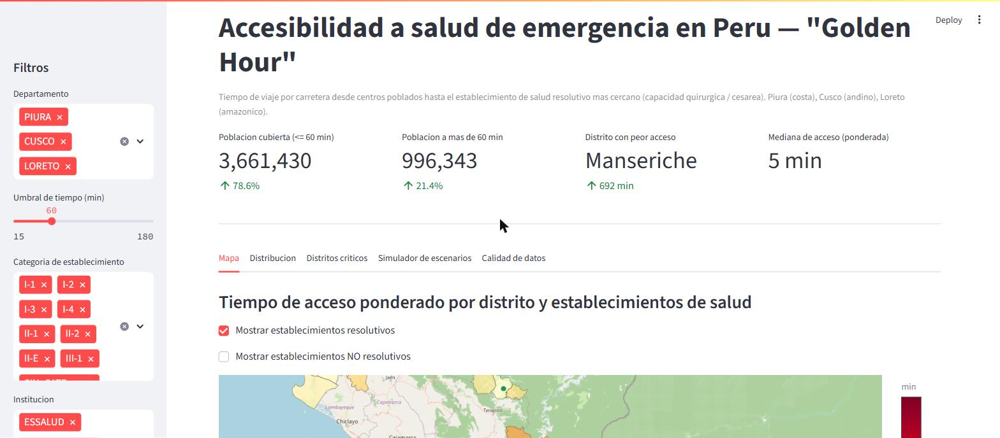
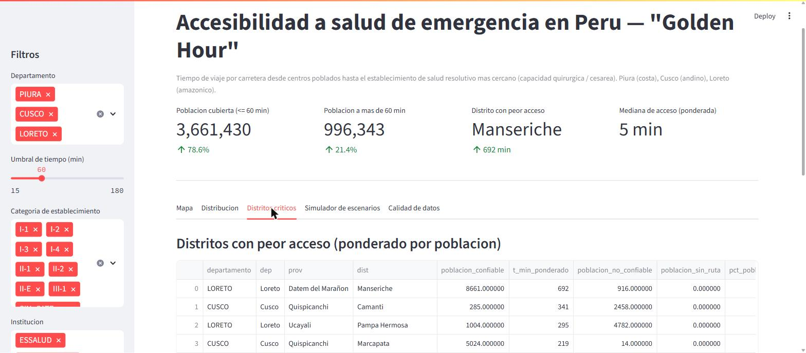

# Accesibilidad a salud de emergencia en Perú ("Golden Hour")

Proyecto integrador (HW_02_202602): tiempos de viaje por carretera desde
centros poblados hasta el establecimiento de salud resolutivo más cercano
(capacidad quirúrgica / cesárea), en tres departamentos de Perú que
representan costa, sierra y selva.

Ver el enunciado completo en el issue del curso y los parámetros del
análisis (departamentos, umbrales, motor de ruteo) en [`config.md`](config.md).

**📄 [Reporte técnico completo (PDF, 9 páginas)](report/main.pdf)**

## Resultados principales

Pipeline reproducible sobre 10,801 puntos de demanda (4.66 millones de
habitantes) en Piura, Cusco y Loreto. El hallazgo central es la brecha
entre regiones: mientras el 78% de la población conjunta llega en menos
de 60 minutos a un establecimiento resolutivo, en **Loreto el 43.9% de
los puntos de demanda no tiene ningún tiempo de acceso vial confiable**
—la red mapeada en OpenStreetMap es prácticamente inexistente fuera de
Iquitos— y 162 puntos (9%) no tienen ninguna ruta válida en absoluto.

| Departamento | Población | T. acceso ponderado | Gini | % sin dato confiable |
|---|---:|---:|---:|---:|
| Piura | 2,195,231 | 26.3 min | 0.713 | 0.01% |
| Cusco | 1,396,496 | 33.6 min | 0.650 | 1.6% |
| Loreto | 1,066,046 | 22.7 min* | 0.696 | 43.9% |

\* Engañosamente bajo: se calcula solo sobre el 56% de la población de
Loreto con dato confiable, dominado por Iquitos. Ver el reporte para el
detalle.

El distrito con peor acceso confiable es **Manseriche** (Loreto, 692 min
ponderados). El detalle completo, la metodología, y la discusión de cada
hallazgo están en el [reporte técnico](report/main.pdf) y en
[`config.md`](config.md).

### Dashboard interactivo

| Mapa + KPIs | Distritos críticos |
|---|---|
|  |  |

`streamlit run app.py` (ver instrucciones más abajo) levanta un
dashboard con mapa, distribución del tiempo de acceso, distritos
críticos, un simulador de escenarios (upgradear establecimientos I-3/I-4
a resolutivos) y un panel de calidad de datos.

## Estado del proyecto

Este repo se construye de forma incremental, fase por fase:

1. Scaffold del repositorio
2. Adquisición de datos (RENIPRESS, límites administrativos, centros poblados)
3. Validación de datos (6 reglas sobre RENIPRESS + reporte de calidad)
4. Routing completo (3 departamentos, matriz vía OSRM + hallazgo Loreto)
5. Métricas (cobertura, Gini, urbano/rural, distritos críticos)
6. Dashboard Streamlit (probado en navegador real)
7. Reporte LaTeX (9 páginas, compilado a PDF)

## Estructura del repositorio

```
├── config.md               # todos los parámetros (departamentos, umbrales, rutas, motor de ruteo)
├── requirements.txt
├── docs/screenshots/         # capturas del dashboard usadas en este README
├── src/
│   ├── config.py             # parser del bloque yaml en config.md
│   ├── acquisition.py       # Fase 1 — descarga de fuentes
│   ├── demand_urbano.py      # Fase 1 — construye puntos de demanda urbana (ver config.md)
│   ├── validation.py        # Fase 1 — reglas de calidad de datos
│   ├── routing.py           # Fase 2 — motor de ruteo + caché
│   ├── metrics.py           # Fase 3 — indicadores de acceso
│   └── export.py            # tablas/figuras para el reporte
├── data/
│   ├── raw/                 # descargas crudas, nunca se modifican (no versionado, ver .gitignore)
│   ├── processed/           # datasets limpios (GeoParquet/GeoPackage)
│   └── outputs/             # tablas/figuras finales usadas en el reporte y dashboard
├── app.py                   # Fase 4 — dashboard Streamlit
├── report/
│   ├── main.tex              # Fase 5 — reporte técnico (fuente)
│   ├── main.pdf               # Fase 5 — reporte técnico (compilado)
│   ├── figures/                # generadas por src/export.py
│   └── tables/                 # generadas por src/export.py
└── logs/                     # logs de ejecución y reporte de calidad de datos
```

## Setup

```bash
python -m venv .venv
.venv\Scripts\activate          # Windows
pip install -r requirements.txt
```

### Motor de ruteo (OSRM vía Docker)

Requiere Docker Desktop (WSL2 backend en Windows). Con el extracto de
`data/raw/osm/peru-latest.osm.pbf` ya descargado (ver `logs/download_manifest.json`),
el grafo se construye una sola vez con:

```bash
docker run -t -v "${PWD}/data/raw/osm:/data" osrm/osrm-backend osrm-extract -p /opt/car.lua /data/peru-latest.osm.pbf
docker run -t -v "${PWD}/data/raw/osm:/data" osrm/osrm-backend osrm-partition /data/peru-latest.osrm
docker run -t -v "${PWD}/data/raw/osm:/data" osrm/osrm-backend osrm-customize /data/peru-latest.osrm
```

Y se sirve con (contenedor persistente, nombrado para poder pararlo/verlo
con `docker ps` / `docker logs osrm-server`):

```bash
docker run -d --name osrm-server -p 5000:5000 -v "${PWD}/data/raw/osm:/data" osrm/osrm-backend osrm-routed --algorithm mld --max-table-size 1000000 /data/peru-latest.osrm
```

Verificar que está listo (tarda ~15-30s en cargar el grafo en memoria):

```bash
curl "http://localhost:5000/route/v1/driving/-77.0428,-12.0464;-77.1465,-11.9950?overview=false"
```

Los archivos `peru-latest.osrm*` (~1.5GB) no se versionan en git; se
regeneran con los comandos de arriba. Si Docker Desktop estaba apagado,
abrirlo primero y esperar a que el daemon responda (`docker info`) antes
de correr `docker run`.

## Cómo correr el pipeline

### Fase 1a — Adquisición de datos

```bash
cd src
python acquisition.py
```

Descarga (o reutiliza si ya existen) RENIPRESS, límites administrativos,
centros poblados dispersos, capitales distritales y población distrital
proyectada hacia `data/raw/`, y registra cada descarga en
`logs/download_manifest.json`. Es re-ejecutable sin re-descargar: pasar
`force=True` a las funciones individuales para forzar una descarga nueva.

Luego, para construir los puntos de demanda urbana (población urbana
estimada por distrito = población total proyectada − población dispersa,
ver [`config.md`](config.md)):

```bash
python demand_urbano.py
```

Genera `data/processed/demand_points_urbano.geojson` e imprime una
verificación cruzada contra los totales departamentales del Excel de
INEI (ver salida del script para las diferencias residuales conocidas).

### Fase 1b — Validación de datos

```bash
python validation.py
```

Aplica las 6 reglas de calidad de datos (ver [`config.md`](config.md))
sobre los establecimientos RENIPRESS de los 3 departamentos, normaliza
`CATEGORIA`/`ESTADO` a la definición de "resolutivo", y exporta:

- `data/processed/renipress_validado.parquet` — todos los registros, con
  una columna de banderas por regla (nada se descarta silenciosamente) y
  `coords_utilizables` para saber cuáles sirven para ruteo en Fase 2.
- `logs/data_quality_report.json` — conteos y la acción tomada por cada
  regla.

### Fase 2 — Routing

Con el servidor OSRM corriendo (ver arriba):

```bash
python routing.py PIURA   # o CUSCO / LORETO
```

Construye la demanda (dispersos + urbano) y la oferta (RENIPRESS
resolutivo/activo/coords utilizables) del departamento indicado, consulta
`/table` de OSRM por lotes, y cachea la matriz completa en
`data/processed/routing_cache/matrix_<depto>.parquet` (**versionada en
git** — deliverable explícito para que el dashboard funcione sin el motor
de ruteo levantado). Imprime progreso por lote, estadísticas de snapping,
y la comparación distancia recta vs. red; el detalle completo queda en
`logs/routing_report_<depto>.json`. Es re-ejecutable sin recomputar
(`force=True` en `build_matrix` para forzar).

**Importante:** en Loreto, 86% de los puntos de demanda no tienen una vía
mapeada cerca (mediana de distancia a la red: 43km) — el ruteo por auto no
representa cómo se moviliza esa población. Cada par queda marcado con
`snap_confiable` en la matriz; ver la sección de Fase 2 en
[`config.md`](config.md) para el detalle completo, es una limitación
central del análisis, no un error del pipeline.

Para el simulador de escenarios de Fase 4 hace falta ademas la matriz
demanda x establecimientos candidatos (I-3/I-4, no resolutivos hoy):

```bash
python -c "from routing import build_matrix; [build_matrix(d, candidatos=True) for d in ['PIURA','CUSCO','LORETO']]"
```

### Fase 3 — Métricas

```bash
python metrics.py
```

Junta las 3 matrices de ruteo con la demanda y calcula todas las métricas
de acceso, exportadas a `data/outputs/`: `access_table.csv` (una fila por
punto de demanda), bandas de cobertura, tiempo de acceso ponderado por
distrito/provincia/departamento, `distritos_criticos.csv`, Gini/Lorenz
(`gini_lorenz.json`), contraste urbano/rural, y el cruce con tamaño de
población (`cruce_poblacion_acceso.json`). Clasifica cada punto en
`confiable` / `no_confiable` / `sin_ruta` (ver [`config.md`](config.md),
sección Fase 3) para que las rutas de OSRM con snap lejano o velocidad
implícita irreal (p. ej. 409km en 4,906 min en un caso real de Loreto) no
contaminen los promedios ponderados.

### Fase 5 — Reporte LaTeX

```bash
python export.py            # genera report/figures/ y report/tables/ desde data/outputs/
cd ..\report
pdflatex main.tex && pdflatex main.tex   # 2 pasadas, para resolver referencias cruzadas
```

Requiere una distribución LaTeX (MiKTeX o TeX Live) con `pdflatex`. La
primera compilación puede tardar varios minutos si MiKTeX necesita
instalar paquetes faltantes (`babel`, `caption`, `float`, `cmap`, etc.)
automáticamente. Produce `report/main.pdf` (9 páginas). Tanto `main.tex`
como `main.pdf` están versionados en git.

## Cómo correr el dashboard

```bash
streamlit run app.py
```

Lee unicamente los archivos precomputados de `data/outputs/`,
`data/processed/` y `logs/` (Fases 1-3) — no necesita el servidor OSRM
levantado. Cinco pestañas: mapa (choropleth + facilities), distribución,
distritos críticos, simulador de escenarios (upgrade de I-3/I-4 a
resolutivo — requiere haber corrido `build_matrix(..., candidatos=True)`,
ver Fase 2 arriba, y seleccionar exactamente un departamento), y calidad
de datos. Probado end-to-end en Chrome.

## Fuentes de datos

- RENIPRESS / SUSALUD (establecimientos de salud) — CSV mensual de datosabiertos.gob.pe
- Centros poblados dispersos (INEI, vía geoportal IDEP, ArcGIS REST) —
  **sustituye** a MINEDU/SIGMED, que resultó ser una app interactiva sin
  endpoint estable. Ver la sección "Fuentes de datos y sustituciones
  documentadas" en [`config.md`](config.md) para el detalle y una
  limitación conocida (solo cubre población rural dispersa, no urbana).
- Límites administrativos (departamento/provincia/distrito) — HDX COD-AB
  Perú, fuente original IGN
- OpenStreetMap — extracto de Perú (Geofabrik)

Fechas de descarga, tamaños y publishers se documentan automáticamente en
`logs/download_manifest.json` cada vez que se corre `acquisition.py`.

## Limitaciones conocidas

Detalle completo en la Sección 6 del [reporte técnico](report/main.pdf)
y en [`config.md`](config.md). Resumen:

- **Cobertura de OpenStreetMap en la Amazonía** — límite metodológico
  central, no una nota al pie. Mediana de distancia de un punto de
  demanda de Loreto a la vía mapeada más cercana: 43.3 km (máx. 414 km).
  El ruteo vehicular es estructuralmente inadecuado para representar
  cómo se moviliza la mayoría de la población amazónica (transporte
  fluvial).
- **29% de los establecimientos RENIPRESS** de los 3 departamentos no
  tienen coordenadas utilizables; 15.6% de los geocodificados caen fuera
  de su distrito declarado (verificado: dentro de un distrito real y
  contiguo, no basura).
- **Supuesto de disponibilidad**: un establecimiento `ACTIVO` en
  RENIPRESS no garantiza camas, quirófano libre, o personal de guardia
  en el momento de la emergencia.
- **Sin datos de ambulancias**: se asume acceso inmediato a un vehículo,
  sin modelar tiempo de despacho.
- **Población urbana estimada, no censada directamente**: no existe una
  capa pública con población urbana concentrada como puntos
  individuales; se estimó por distrito (total proyectado INEI 2026 menos
  población dispersa censada), simplificación deliberada.
- **Discrepancia residual de población**: Cusco (4 distritos creados en
  2021, aún no reflejados en los límites administrativos usados) y
  Loreto (discrepancia que ya existe dentro del propio Excel de INEI).
- **Vigencia de fuentes**: límites administrativos al 2020-07-14,
  RENIPRESS al 31 de agosto de 2026, población dispersa del Censo 2017.
- **Alcance geográfico**: resultados de Piura/Cusco/Loreto no son
  necesariamente generalizables a otros departamentos.
